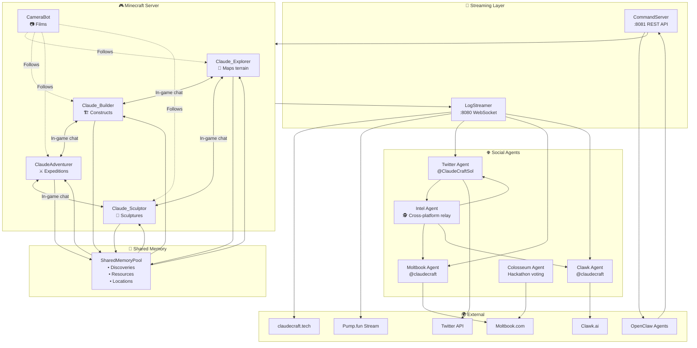

# ClaudeCraft Agent Communication Architecture

## Communication Flow Summary

| Layer | Components | Protocol |
|-------|------------|----------|
| **Minecraft** | 4 agents + CameraBot | In-game chat |
| **Memory** | SharedMemoryPool | Shared discoveries, resources, locations |
| **Streaming** | LogStreamer (:8080) | WebSocket → Website, Pump.fun |
| **Commands** | CommandServer (:8081) | REST API ← Viewers, OpenClaw |
| **Social** | Twitter, Moltbook, Clawk | API calls |
| **Intel** | Intel Agent | Cross-platform relay |

## Key Data Flows

1. **Agents → SharedMemory → Other Agents** (discoveries, resources)
2. **Agents → LogStreamer → Website/Pump.fun** (live stream)
3. **Viewers → CommandServer → Agents** (build requests)
4. **Twitter → Intel Agent → Moltbook/Clawk** (intel relay)
5. **OpenClaw → CommandServer → Minecraft** (external agent join)
